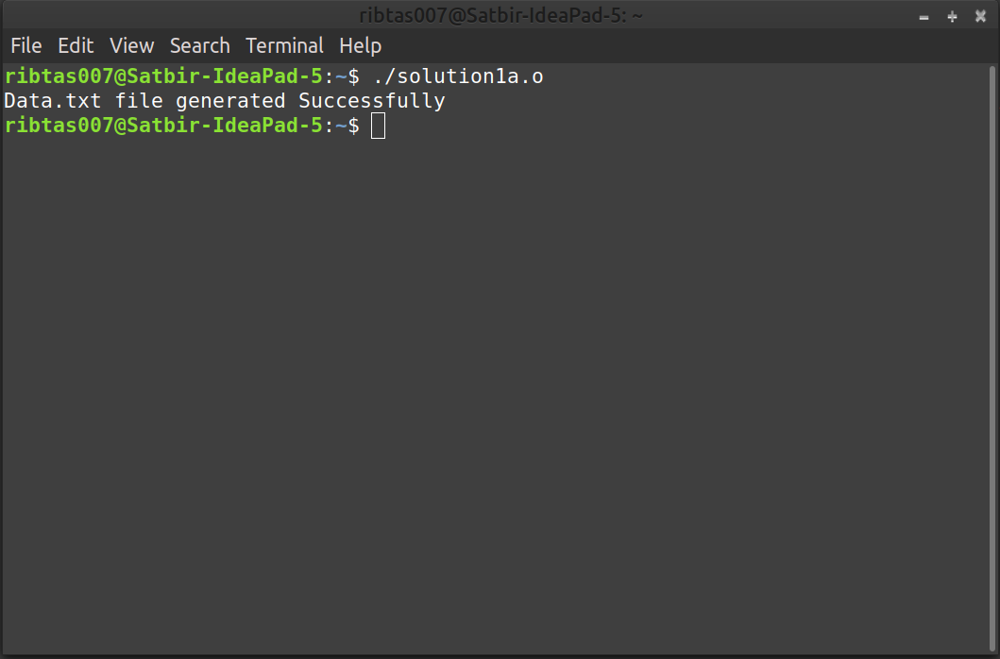
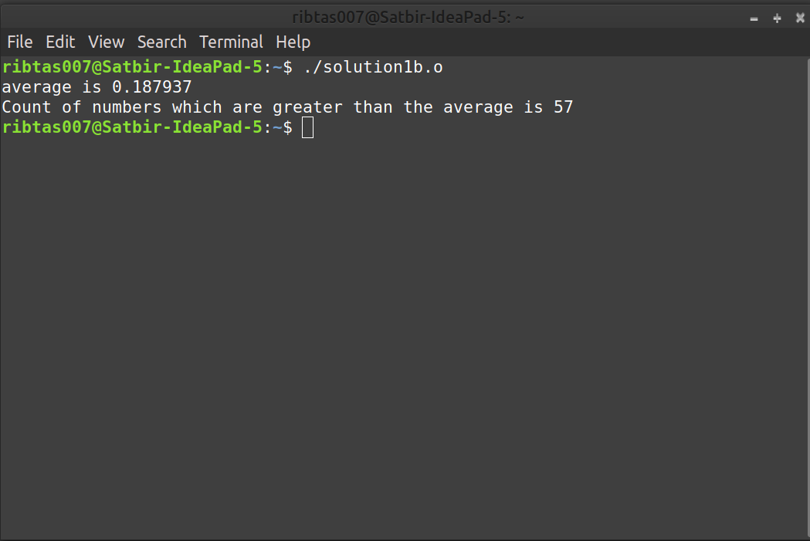
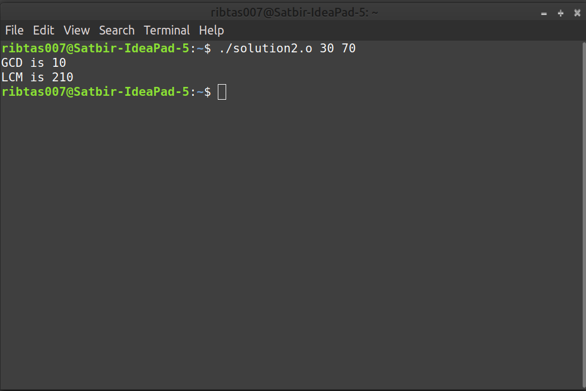
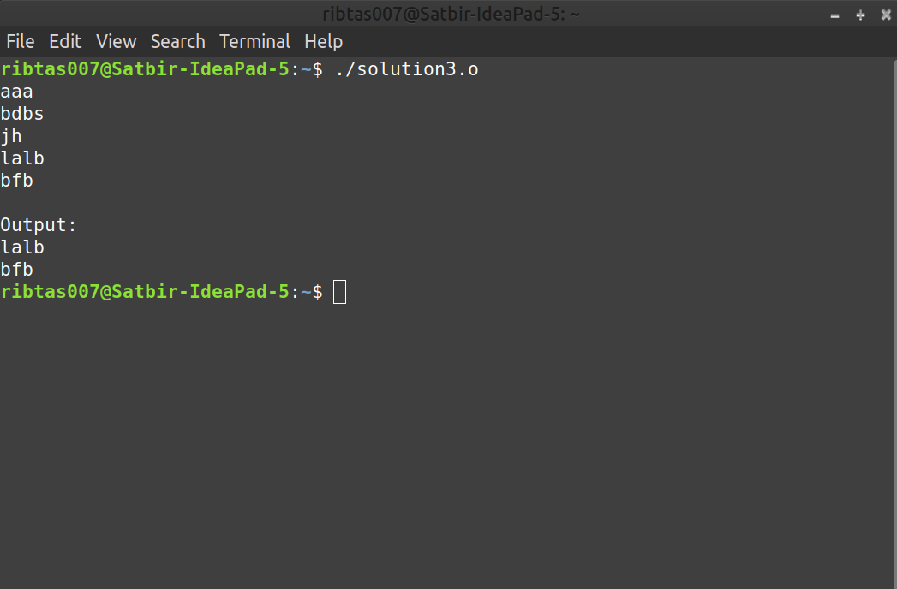

# Data Structures and Algorithms (CS506)
# Lab Assignment 2 

1. Problems related to file handling in C:
    1.  Write a C program that generates 100 random numbers and write them in a file “data.txt” following the instructions given below:
        -    First line of the file “data.txt” contains the number 40, and the next 40 lines contain 40 random numbers between 0.0 to 1.0 exclusive. (That
is, these 40 random numbers should not include 0.0 and 1.0). 
        -    The next line of the file “data.txt” contains the number 60, and the next 60 lines contain 60 random numbers between the numbers −0.8 to 0.8, again
exclusive. (That is, these 60 random numbers should not include −0.8 and 0.8). 
        -    **Expected output**: depends on the program.

    Sol1a. Download the [Solution1a](solution1a.o) file. Open terminal and execute it by running `./solution1a.o` command. [data.txt](data.txt) file is generated.

    
    

    2.  Write a C program that reads the data from the file data.txt (created above) and computes the average of the data. It also finds the number of data above (≥) the average value.
        -    **Expected output**: depends on the program.
    
    Sol1b. Download the [Solution1b](solution1b.o) file. Open terminal and execute it by running `./solution1b.o` command.

    
    
2. Write a C program to find GCD (Greatest Common Divisor) and LCM (Least Common Multiple) of any two positive integers using command line arguments.

   **Sample input 1**: ./a.out 5 7   
   **Output 1**: GCD= 1 LCM = 35   
   **Sample input 2**: ./a.out 10 20   
   **Output 2**: GCD=10 LCM = 20   
   
      Sol2. Download the [Solution2](solution2.o) file. Open terminal and execute it by running `./solution2.o arg1 arg2` command.

      
   
3. Write a C program which prints the last **n** lines of its input (the input is given by the user). By default **n** is **2**, let us say, but it can be changed by an optional
command line argument.

    **Sample input 1** 
    ./a.out  
    aa  
    bb  
    cc  
    dd  
    ee  

    **Output 1**:  
    dd  
    ee  

    **Sample input 2**  
    ./a.out 4  
    aa  
    bb  
    cc  
    dd  
    eee  
    ffff  
    gg  

    **Output 2**:  
    dd  
    eee  
    ffff  
    gg  
    
    
   Sol3. Download the [Solution3](solution3.o) file. Open terminal and execute it by running   `./solution3.o`   `arg1`   `arg2`  `...`  `argn` command.

   
