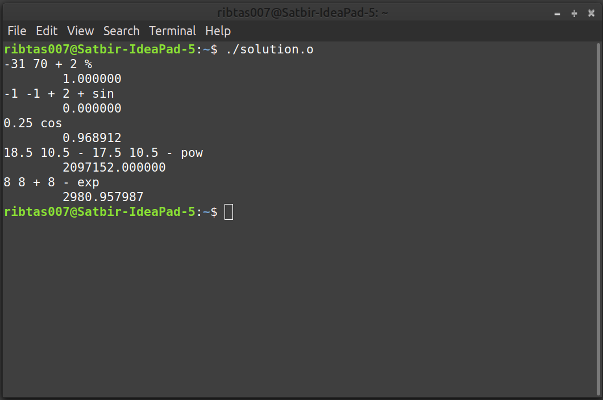

# Data Structures and Algorithms (CS506)
# Lab Assignment 3

1.  Recall in one of the lectures, we have designed a calculator program. The calculator program implemented the reverse Polish notation and provided the operator +, −, ∗, /.
      
     - In the reverse Polish notation, each operator follows its operands; an infix expression like (1 − 2) ∗ (4 + 5) is entered as 1 2 − 4 5 + ∗.
      
     - Parenthesis is not needed in the reverse Polish notation.
      
     - Your task is to extend the calculator program to include the modulus (%) operator and the provisions for negative numbers as well. 
      
     - Your calculator program should also be capable of handling and computing the sin, cos, exp,and pow functions. 
      
     - Please refer the sample inputs and outputs to better understand what all are expected from your calculator program.
      
     - You are allowed to use the standard libraries sin, cos, exp, and pow from math.h. 

    Sample input 1):
    
        Input: -31 70 + 2 %
    
        Output: 1
    
    Sample input 2):
    
        Input: -1 -1 + 2 + sin

        Output: 0
    
    *Why output is 0? when first + encouter: push(-2), when second + encounter: push(0), when sin encounter: push(sin(0)), when newline encounter: pop: 0, as sin(0) =0*

    Sample input 3):

        Input: 0.25 cos

        Output: 0.96891242

    *as cos(0.25) = 0.96891242*

    Sample input 4):

        Input: 18.5 10.5 - 17.5 10.5 - pow

        Output: 2097152 *as 8^7 = 2097152*

    Sample input 5):

        Input: 8 8 + 8 - exp

        Output: 2980.958 *as e^8 = 2980.958, where e is the mathematical constant called Euler’s number: e ≈ 2.71828*
        
Sol. Download the [Solution](solution.o) file. Open terminal and execute it by running `./solution.o` command. Give inputs to get outputs

   
