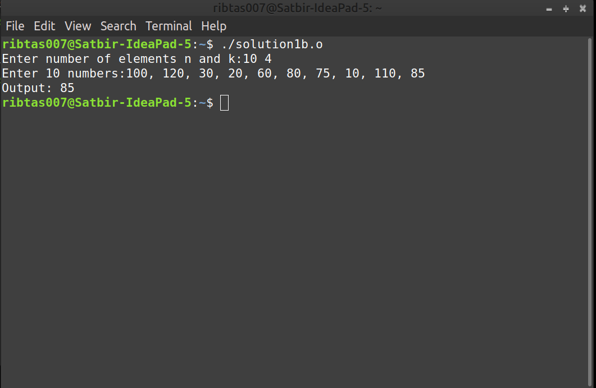

# Data Structures and Algorithms (CS506)
# Lab Assignment 4

1. **Selection problem**: The input is a list of **n** integers, and an integer **k**. The selection problem is to find the **k**th largest element. Below, we describe two algorithms to solve this problem. Your job is to implement both the algorithms.
      
      a. **Algorithm 1a**: The algorithm reads **n** integers into an array. Apply **BUILD-MAX-HEAP** algorithm to this array. Then apply **k** times **EXTRACT-MAX** operations. Return the last element extracted from the heap as the answer. Clearly, the running time of this algorithm is
**O(n + k log n)**.

      Sol1a. Download the [Solution1a](solution1a.o) file. Open terminal and execute it by running `./solution1a.o` command. Give inputs to get ourputs.

      

      b. **Algorithm 1b**: At any point of time the algorithm maintain a set **S** of the **k** largest elements. After the first **k** elements are read, when a new element is read it is compared with the **k**th largest element, which we denote by **S_k** . Note that **S_k** is the smallest element in **S**. If the new element is larger, then it replaces **S_k** in **S**. **S** will then have a new smallest element, which may or may not be the newly added element. At the end of the input, the algorithm find the smallest element in **S** and return it as the answer.

   You are instructed to use min-heap to implement **S**. The first **k** elements are placed into the min-heap in **O(k)** time. For the remaining elements do the following: test in **O(1)** time whether the new element goes into **S** (min-heap), if yes, delete **S_k** (the root element of the min-heap **S**) and insert the new element. Clearly, inserting the new element takes **O(log k)** time. Thus total time required: **O(k + (n − k) log k) = O(n log k)**. 

   **Note**: We can solve this problem in **O(n)** average time. This is just for your information.

   **Test Case**:

                Input: Enter number of elements n and k: 10 4
                Enter 10 numbers: 100, 120, 20, 30, 10, 110, 90, 65, 40, 50
                Output: 90
   
   Sol1b. Download the [Solution1b](solution1b.o) file. Open terminal and execute it by running `./solution1b.o` command. Give inputs to get ourputs.

   
