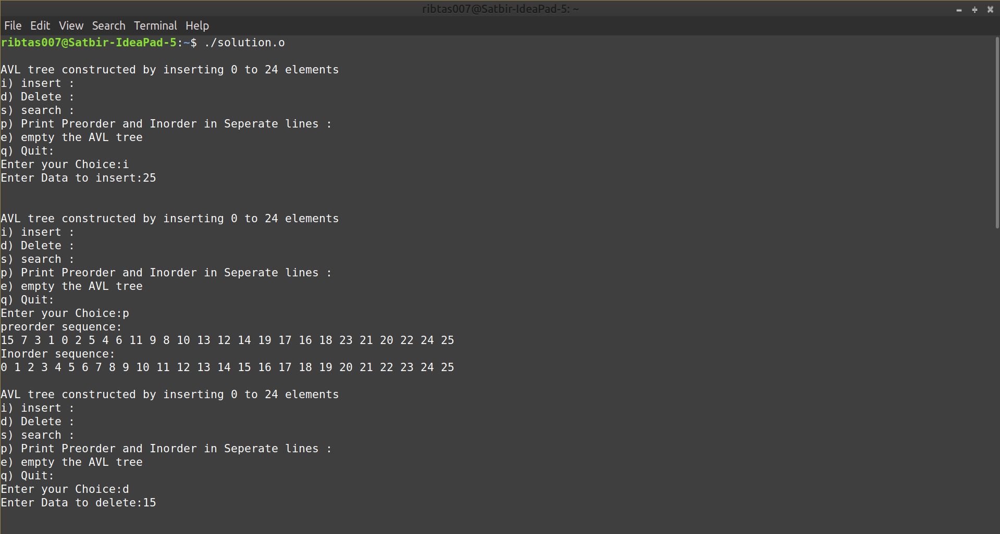
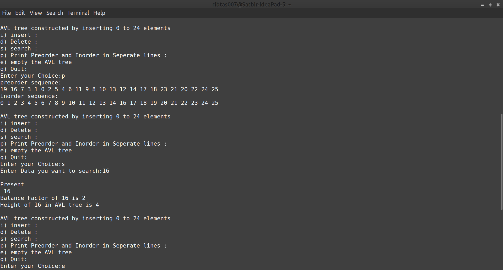
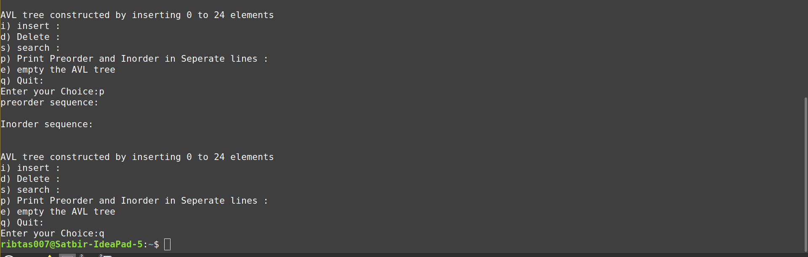

# Data Structures and Algorithms (CS506)
# Lab Assignment 5

1. Implement the data structure AVL tree. To begin with your program should enter integers **0, 1, . . . , 24** in an empty AVL tree in this order. In addition, your program should support the following operations. Also, provide the user to choose various operations. Refer test input cases for the detail.

   **insertion**: User should choose **i** for insertion: this operation insert the integer, entered by user in the AVL tree,
   
   **deletion**: User should choose **d** for deletion: this operation deletes the integer from the AVL tree, entered by user. If the entered integer is not present, do nothing.
   
   **search**: User should choose **s** for search: search the integer, entered by the user, in the AVL tree. If the element is not present, print: not present. Otherwise, print present, along with the balance factor and the height of the searched element in the AVL tree.
   
   **print**: User should choose **p** to print the preorder and the inorder traversals of the AVL tree.

   **empty**: User should choose **e** to empty the entire AVL tree.
   
   **Test Case**:
   
   Input:
   
   AVL tree constructed by inserting 0 to 24 elements  
   
    i.  Insert :  
    d.  Delete :  
    s.  search :  
    p.  Print Preorder and Inorder in Separate lines:  
    e.  empty the AVL tree  
    q.  Quit:  
  
    **Enter Your Choice**: i  
    **Enter a data to insert**: 25  

    i) Insert : 
    d) Delete : 
    s) search : 
    p) Print Preorder and Inorder in Separate lines: 
    e) empty the AVL tree 
    q) Quit: 

    **Enter Your Choice**: p 
    Preorder sequence: 
    15 7 3 1 0 2 5 4 6 11 9 8 10 13 12 14 19 17 16 18 23 21 20 22 24 25 
    Inorder sequence: 
    0 1 2 3 4 5 6 7 8 9 10 11 12 13 14 15 16 17 18 19 20 21 22 23 24 25 

    i) Insert : 
    d) Delete : 
    s) search : 
    p) Print Preorder and Inorder in Separate lines: 
    e) empty the AVL tree 
    q) Quit: 

    **Enter Your Choice**: d 
    **Enter data to delete**: 15 

    i) Insert : 
    d) Delete : 
    s) search : 
    p) Print Preorder and Inorder in Separate 
    e) empty the AVL tree 
    q) Quit: 

    **Enter Your Choice**: p  
    Preorder sequence: 
    16 7 3 1 0 2 5 4 6 11 9 8 10 13 12 14 19 17 18 23 21 20 22 24 25 
    Inorder sequence: 
    0 1 2 3 4 5 6 7 8 9 10 11 12 13 14 16 17 18 19 20 21 22 23 24 25 

    i) Insert : 
    d) Delete : 
    s) search : 
    p) Print Preorder and Inorder in Separate 
    e) empty the AVL tree 
    q) Quit: 

    **Enter Your Choice**: s 
    Enter data you want to search: 16 
    present 
    Balance factor of 16 is 0 
    Height of 16 in AVL tree is 4 

    i) Insert : 
    d) Delete : 
    s) search : 
    p) Print Preorder and Inorder in Separate lines: 
    e) empty the AVL tree 
    q) Quit: 

    **Enter Your Choice**: e 

    i) Insert : 
    d) Delete : 
    s) search : 
    p) Print Preorder and Inorder in Separate lines: 
    e) empty the AVL tree
    q) Quit: 

    **Enter Your Choice**: p 
    Preorder sequence: 
    Inorder sequence: 

    i) Insert : 
    d) Delete : 
    s) search : 
    p) Print Preorder and Inorder in Separate lines: 
    e) empty the AVL tree 
    q) Quit: 

    **Enter Your Choice**: q 
    
    Sol. Download the [Solution](solution.o) file. Open terminal and execute it by running `./solution.o` command. Give inputs to get outputs

   
   
   
