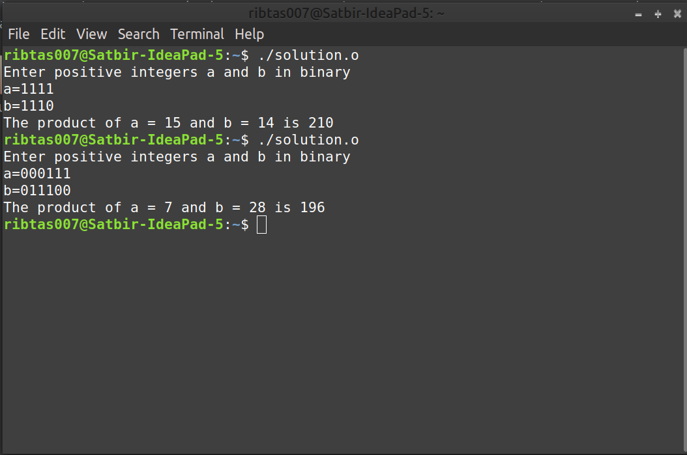

# Data Structures and Algorithms (CS506)
# Lab Assignment 7 

1. Write a C-program to multiply two positive integers a and b in binary using the
divide-and-conquer approach. Your algorithm should run in time **O(n^log3 ) = O(n^1.59 )**, where **n** is the number of bits of the inputs **a** and **b**. Assume that the
length of both the inputs are same. Your program should output the result in integer (not in binary). 
Refer some test cases below:

    **Hint**: Refer Section 5.5 in the following book: Algorithm Design by Kleinberg and Tardos.
    
    Test case 1:
    
         Enter positive integers a and b in binary
         a = 1111
         b = 1110
         The product of a=15 and b=14 is 210
        
    Test case 2:
    
         Enter positive integers a and b in binary
         a = 000111
         b = 011100
         The product of a= 7 and b = 28 is 196
 
 Sol. Download the [Solution](solution.o) file. Open terminal and execute it by running "./solution.o" command.Give input and get output. 

   
